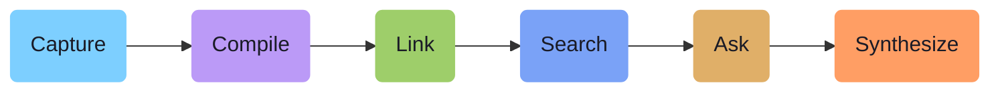
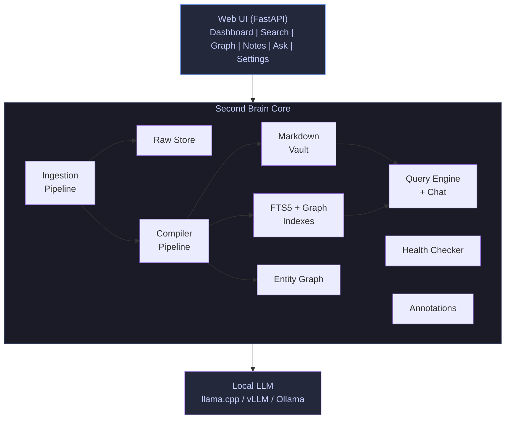
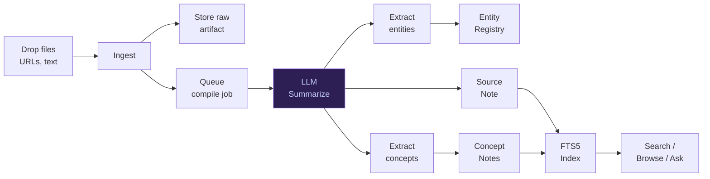
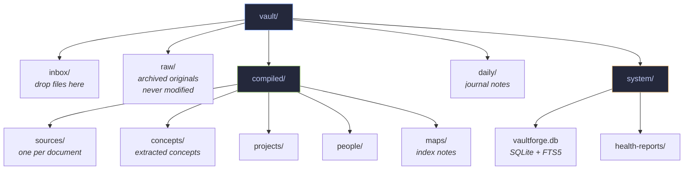
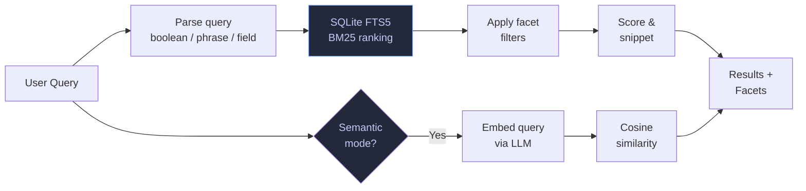
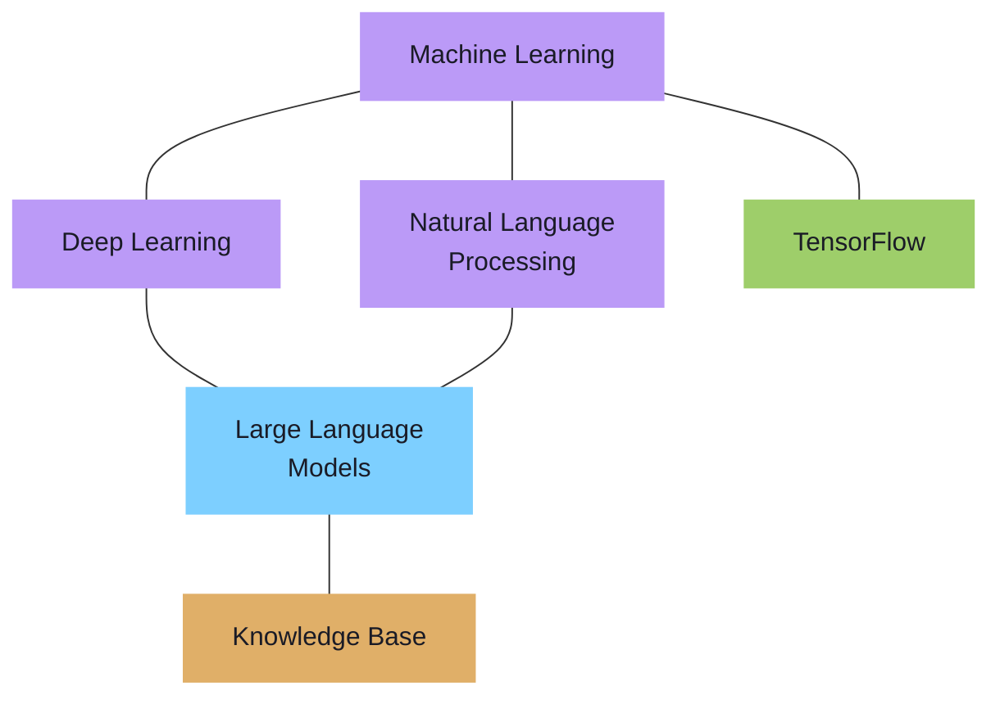
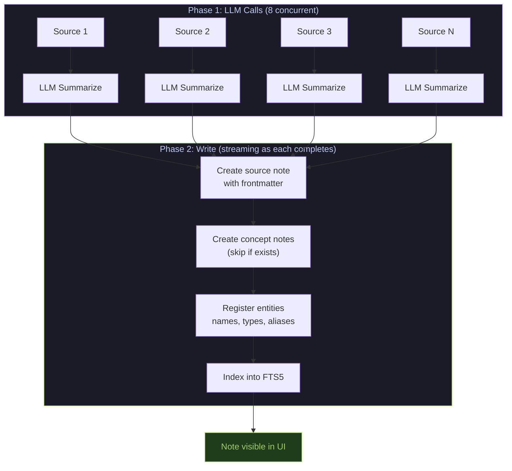
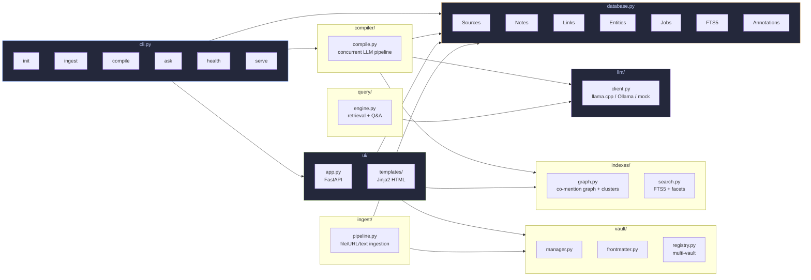

# VaultForge

**Local LLM-powered second brain / knowledge compiler.**

VaultForge ingests your documents, notes, PDFs, and web pages, then uses a local LLM to compile them into a navigable, searchable, Obsidian-compatible Markdown knowledge base with concept extraction, entity linking, and full-text search.

> The LLM is not the final brain; the vault is the brain.



---

## Quick Start

### Prerequisites

- **Python 3.11+**
- **A local LLM server** — any OpenAI-compatible endpoint (llama.cpp, vLLM, Ollama)

### Install

```bash
# Clone and install
cd vaultforge_second_brain
./scripts/install.sh

# Or manually:
pip install -e ".[dev]"
```

### Create a Vault and Start

```bash
# Initialize a new vault
secondbrain init ~/SecondBrain

# Start the web UI
secondbrain serve --vault ~/SecondBrain --port 8184
```

Open **http://localhost:8184** in your browser.

### One-Line Start (after install)

```bash
./scripts/start.sh ~/SecondBrain
```

---

## Architecture



### Data Flow



### Storage



The Markdown vault is the source of truth. The SQLite database is disposable — it can always be rebuilt from the files.

---

## Web UI

Start with `secondbrain serve --vault <path> --port <port>`.

### Pages

| Page | URL | Description |
|------|-----|-------------|
| **Dashboard** | `/` | Stats, recent notes/sources, compile button |
| **Notes** | `/notes` | Browse all compiled notes, filter by type |
| **Note Detail** | `/notes/<id>` | Metadata, content, links, "Read Full Document" |
| **Concepts** | `/concepts` | All concepts sorted by mention count |
| **Concept Detail** | `/concepts/<name>` | Notes mentioning concept, co-mentioned concepts |
| **Entities** | `/entities` | Searchable entity registry with type filters |
| **Entity Detail** | `/entities/<id>` | Notes mentioning entity, related entities |
| **Graph** | `/graph` | Interactive D3 force graph of concept clusters |
| **Search** | `/search` | Full-text search with facets and query builder |
| **Ingest** | `/ingest` | Upload files, paste URLs, write quick notes |
| **Ask Vault** | `/ask` | Question answering with source citations |
| **Activity Log** | `/log` | Live compile/ingest progress |
| **Health** | `/health` | Orphan notes, broken links, stale content |
| **Vaults** | `/vaults` | Register and switch between multiple vaults |
| **Settings** | `/settings` | LLM backend configuration |

### Document Viewer

Click "Read" on any note to open the viewer:
- **Markdown** — rendered with clickable `[[wikilinks]]`, toggle to raw source
- **PDF** — embedded inline viewer
- **Text/code** — syntax display

Every document has an **annotation toolbar**:
- **Star** — bookmark important notes (searchable via facets)
- **Labels** — categorize with custom labels (e.g. "review-needed", "project-alpha")
- **User Tags** — your own tag taxonomy, separate from LLM-extracted tags
- **Summarize** — one-click LLM summary, saved and displayed inline

### Search



FTS5-powered search with:
- **Boolean operators** — `kafka AND partitions`, `kafka OR redis`, `kafka NOT zookeeper`
- **Exact phrases** — `"machine learning"`
- **Prefix matching** — `mach*`
- **Proximity** — `NEAR(kafka partitions, 5)`
- **Field-specific** — `title : kafka`, `tags : arduino`
- **Combined** — `title : "event sourcing" AND tags : architecture`
- **Faceted filtering** — note type, tags, confidence, starred, labels, user tags
- **Query Builder** — visual clause builder for complex queries
- Porter stemming — "running" matches "run", "runs"

### Concept Graph



Interactive D3 force-directed visualization:
- Nodes sized by mention count, colored by type
- **Focus** — type a concept name to show only its cluster within N hops
- **Clusters** — connected components detected and listed
- **Summarize Cluster** — LLM generates a summary of related concepts
- Click any node to explore its connections, navigate to concept page or note

---

## CLI Reference

All commands support `--vault <path>` (defaults to current directory).

### `secondbrain init <path>`

Create a new vault with the full directory structure and SQLite database.

```bash
secondbrain init ~/SecondBrain
```

### `secondbrain ingest <files...>`

Ingest one or more files or directories.

```bash
# Single file
secondbrain ingest paper.pdf --vault ~/SecondBrain

# Multiple files
secondbrain ingest file1.md file2.pdf file3.txt --vault ~/SecondBrain

# Entire directory
secondbrain ingest ~/Documents/notes/ --vault ~/SecondBrain

# With glob filter
secondbrain ingest ~/Documents/ --glob "*.pdf" --vault ~/SecondBrain

# Recursive
secondbrain ingest ~/Documents/ --glob "*.md" --recursive --vault ~/SecondBrain
```

Supported formats: PDF, Markdown, text, HTML, CSV, JSON, code files (Python, JavaScript, TypeScript, Go, Rust, Java).

### `secondbrain ingest-url <url>`

Fetch and ingest a web page.

```bash
secondbrain ingest-url https://example.com/article --vault ~/SecondBrain
```

### `secondbrain compile`

Compile all pending sources into Obsidian notes using the LLM.

```bash
secondbrain compile --vault ~/SecondBrain

# Control concurrency (default: 8 parallel LLM calls)
secondbrain compile --vault ~/SecondBrain -j 16

# Use a specific model
secondbrain compile --vault ~/SecondBrain --model llama3
```

### `secondbrain ask <question>`

Ask a question and get a source-grounded answer.

```bash
secondbrain ask "What do I know about Kafka ordering?" --vault ~/SecondBrain
```

### `secondbrain health`

Run vault health checks.

```bash
secondbrain health --vault ~/SecondBrain
secondbrain health --vault ~/SecondBrain --save  # save report to system/health-reports/
```

Detects: orphan notes, broken `[[links]]`, duplicate candidates, stale notes, missing provenance, weak summaries, uncompiled sources.

### `secondbrain status`

Show vault statistics.

```bash
secondbrain status --vault ~/SecondBrain
```

### `secondbrain serve`

Start the web UI.

```bash
secondbrain serve --vault ~/SecondBrain --port 8184
secondbrain serve --vault ~/SecondBrain --host 127.0.0.1 --port 9000
```

On startup, the server:
1. Seeds the default LLM config if none exists
2. Auto-starts compiling any pending sources in the background
3. Serves the web UI

---

## LLM Configuration

VaultForge works with any OpenAI-compatible LLM endpoint.

### Supported Backends

| Backend | API | Example URL |
|---------|-----|-------------|
| **llama.cpp** | `/v1/chat/completions` | `http://localhost:8080` |
| **vLLM** | `/v1/chat/completions` | `http://localhost:8000` |
| **Ollama** | `/api/generate` | `http://localhost:11434` |

### Configure via Web UI

1. Go to **Settings** (`/settings`)
2. Enter server URL and click **Probe for Models** to discover available models
3. Select a model and click **Test Connection**
4. Save the configuration and click **Activate**

You can save multiple configurations and switch between them.

### Configure via CLI

The CLI reads the active config from the vault database. Set it up through the web UI first, then CLI commands will use it automatically.

Override the model for a single command:
```bash
secondbrain compile --vault ~/SecondBrain --model llama3
```

---

## Multi-Vault

Register multiple knowledge bases and switch between them:

1. Create vaults: `secondbrain init ~/Work` and `secondbrain init ~/Personal`
2. In the web UI, go to **Vaults** (`/vaults`)
3. Register each vault path with a name
4. Click **Switch To** to change the active vault

The entire UI — search, notes, graph, everything — switches to the selected vault.

---

## Obsidian Compatibility

Compiled notes use standard Obsidian features:
- YAML frontmatter (title, type, tags, aliases, source_ids, confidence)
- `[[Wikilinks]]` for inter-note links
- Standard Markdown formatting

Point Obsidian at your vault's `compiled/` directory to browse notes alongside VaultForge.

---

## How Compilation Works



Each LLM call extracts: title, summary, key ideas, entities, tags, related concepts, and open questions. Notes appear in the UI as each LLM call completes — no waiting for the full batch.

The compiler never overwrites existing concept notes. It only creates new ones or adds source notes. This preserves your manual edits.

---

## Development

### Run Tests

```bash
pip install -e ".[dev]"
python3 -m pytest tests/ -v
```

114 tests covering: database, vault management, frontmatter, ingestion, compilation, query engine, health checks, CLI, LLM client.

### Project Structure



---

## Design Principles

1. **Local-first** — all processing runs locally, no cloud dependencies
2. **File-native** — Markdown files are the source of truth, not a database
3. **Human-editable** — every generated note can be read, edited, and versioned
4. **Provenance-preserving** — every note traces back to its source
5. **Patch-oriented** — existing notes are never overwritten by the compiler
6. **Reviewable** — the LLM proposes; you decide
7. **Obsidian-compatible** — frontmatter, wikilinks, tags, aliases

The vector index is disposable. The Markdown vault is not.
