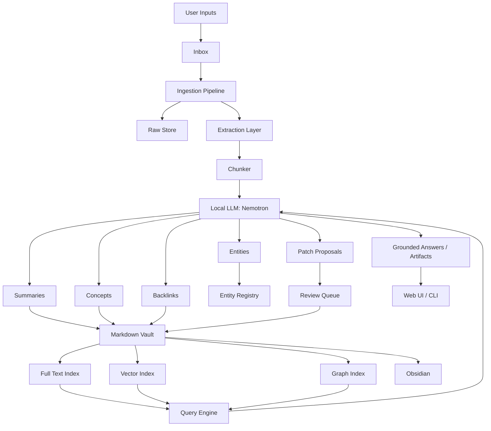

# VaultForge: Local LLM Second Brain / Knowledge Base Plan

## Product Concept

Build a **local knowledge compiler** rather than a generic “chat over documents” app.

The system ingests messy personal information and incrementally turns it into clean Markdown notes, summaries, backlinks, tags, timelines, entities, source provenance, and searchable indexes.

The key idea:

> The LLM is not the final brain; the vault is the brain.

A local Nemotron model acts as the librarian, summarizer, linker, curator, and occasional reasoning assistant. The durable artifact is an Obsidian-compatible Markdown vault.

---

## Core Principles

1. **Local-first** — all processing should run locally by default.
2. **File-native** — Markdown files and raw source files are the source of truth.
3. **Human-editable** — every generated note can be read, edited, versioned, and moved.
4. **Provenance-preserving** — every claim should trace back to a source where possible.
5. **Patch-oriented** — existing notes should be updated carefully rather than duplicated endlessly.
6. **Reviewable automation** — the model proposes changes; the user can approve or reject them.
7. **Hybrid retrieval** — use full-text search, vector search, metadata, and graph traversal.
8. **Obsidian-compatible** — support backlinks, front matter, aliases, tags, and map-of-content notes.

---

## High-Level Goal

Create a tool that turns this:

```text
PDFs
Web pages
Meeting transcripts
Quick notes
Emails
Code repos
Screenshots
Audio notes
Research papers
Design docs
```

Into this:

```text
A durable, navigable, source-grounded Markdown knowledge base
```

With:

```text
Concept notes
Project notes
Decision logs
Daily notes
Source summaries
People and entity pages
Backlinks
Maps of content
Timelines
Action items
Open questions
Health reports
```

---

# Feature Set

## 1. Universal Inbox

The system should provide an ingestion inbox where all raw information lands first.

Supported sources:

| Source | Examples |
|---|---|
| Files | PDFs, Markdown, Word docs, text, code, CSVs |
| Web | URLs, saved articles, documentation pages |
| Notes | Quick capture, voice notes, daily notes |
| Email exports | Important threads, newsletters, receipts |
| Code repos | README files, design docs, issues |
| Meetings | Transcripts, audio-derived notes |
| Images/screenshots | OCR and optional local vision-model descriptions |

Each imported item gets a stable source ID:

```yaml
source_id: sha256(original_content)
imported_at: 2026-04-26T10:00:00-07:00
source_type: pdf | url | markdown | email | transcript | code
canonical_path: raw/2026/04/example.pdf
```

Raw inputs should never be destroyed or overwritten.

---

## 2. Local LLM-Powered Note Compiler

For each raw artifact, Nemotron generates structured Markdown notes.

Example compiled note:

```markdown
---
title: "Kafka Consumer Group Rebalancing"
aliases:
  - "consumer rebalancing"
  - "Kafka partition reassignment"
type: concept
source_ids:
  - raw:2026-04-26:kafka-paper.pdf
confidence: high
created: 2026-04-26
updated: 2026-04-26
tags:
  - kafka
  - distributed-systems
  - streaming
---

# Kafka Consumer Group Rebalancing

## Summary

...

## Key Ideas

...

## Important Details

...

## Related Notes

- [[Kafka Partitions]]
- [[At-Least-Once Delivery]]
- [[Consumer Group Protocol]]

## Open Questions

...

## Source Excerpts

...
```

Supported note types:

| Note Type | Purpose |
|---|---|
| `concept` | Reusable idea, e.g. “idempotency key” |
| `person` | People, authors, contacts |
| `project` | Active or past projects |
| `decision` | Architecture decisions and tradeoffs |
| `source` | One imported artifact |
| `daily` | Daily journal and capture |
| `meeting` | Meeting notes and action items |
| `book` / `paper` | Long-form reading summaries |
| `code` | Repo/module/API understanding |
| `question` | Open research question |
| `map` | Index note linking many notes |

---

## 3. Progressive Summarization

Do not summarize once and stop. Use a multi-level pipeline:

```text
Raw document
  ↓
Chunks with local summaries
  ↓
Document summary
  ↓
Topic notes
  ↓
Map-of-content notes
  ↓
Periodic synthesis notes
```

Example:

```text
raw/articles/kafka-exactly-once.html
compiled/sources/kafka-exactly-once.md
compiled/concepts/idempotent-producer.md
compiled/concepts/transactional-outbox.md
compiled/maps/kafka-delivery-semantics.md
compiled/synthesis/stream-processing-failure-modes.md
```

This allows the vault to improve over time as new material is added.

---

## 4. Obsidian-Native Backlinks and Maps

The compiler should generate Obsidian links:

```markdown
[[Event Sourcing]]
[[CQRS]]
[[Kafka]]
[[Transactional Outbox]]
```

It should also generate map-of-content pages:

```markdown
# Map: Distributed Systems

## Messaging

- [[Kafka]]
- [[NATS JetStream]]
- [[Consumer Groups]]
- [[At-Least-Once Delivery]]

## Storage

- [[RocksDB]]
- [[DynamoDB]]
- [[S3 Data Lake]]

## Consistency

- [[Idempotency]]
- [[Exactly-Once Semantics]]
- [[Saga Pattern]]
```

These map pages make the second brain navigable rather than merely searchable.

---

## 5. Entity and Concept Extraction

Maintain structured registries:

```text
.entities/
  people.yaml
  companies.yaml
  projects.yaml
  technologies.yaml
  papers.yaml
  books.yaml
  concepts.yaml
```

Example entity:

```yaml
- id: tech.kafka
  name: Kafka
  aliases:
    - Apache Kafka
  type: technology
  related:
    - concept.consumer-groups
    - concept.partitioning
    - concept.event-log
```

This helps avoid duplicate notes such as:

```text
Kafka.md
Apache Kafka.md
kafka-event-streaming.md
```

The compiler should perform entity resolution before creating a new page.

---

## 6. Source-Grounded Q&A

The chat interface should answer from the vault and distinguish between:

| Answer Type | Behavior |
|---|---|
| Directly sourced | Cite the exact note/source |
| Synthesized | Cite supporting notes |
| Speculative | Mark as inference |
| Unknown | Say what is missing |
| Contradictory | Show conflicting sources |

Example answer:

```text
Based on your notes, you have three recurring patterns for webhook reliability:

1. Subscriber-level ordering
2. At-least-once delivery
3. Replay from durable queue

The strongest support is in:
- [[Event Conduit Architecture]]
- [[Kafka Delivery Semantics]]
- [[CloudEvents Migration Notes]]

There is one unresolved tension: your notes disagree on whether the retry queue should be Kafka-backed or RocksDB-backed.
```

This avoids the LLM sounding authoritative when the vault does not support the answer.

---

## 7. Artifact Generation

The system should compile knowledge into usable outputs:

| Output | Example |
|---|---|
| Briefing | “Summarize everything I know about NATS vs Kafka” |
| Architecture doc | “Create a design doc for Event Conduit” |
| Interview prep | “Generate STAR stories from my notes” |
| Timeline | “What happened on this project over time?” |
| Decision log | “What architecture choices did I make?” |
| Reading list | “What should I read next?” |
| Flashcards | “Turn this into Anki cards” |
| Diagrams | Mermaid, PlantUML |
| Slide outline | Markdown or PPTX-ready outline |

Architecture synthesis should be a first-class feature:

```text
Sequence diagrams
State machines
Event schemas
Invariants
Failure modes
Tradeoff tables
SLO/SLI definitions
Cloud architecture mappings
```

---

## 8. Vault Health Checks

The system should continuously inspect the vault.

Useful checks:

| Check | Example |
|---|---|
| Duplicate notes | `Kafka.md` vs `Apache Kafka.md` |
| Orphan notes | Notes with no inbound or outbound links |
| Stale notes | “This was last updated 18 months ago” |
| Broken links | `[[Missing Page]]` |
| Weak summaries | Notes with no summary section |
| Missing provenance | Notes without source IDs |
| Contradictions | Two notes disagree about a fact |
| Unresolved questions | Notes with many TODOs |
| Tag drift | `#ml`, `#machine-learning`, `#ai/ml` |
| Topic imbalance | Too many raw docs, few compiled notes |

Example weekly report:

```markdown
# Vault Health Report — 2026-04-26

## Needs Attention

- 14 orphan notes
- 6 duplicate candidates
- 3 stale project notes
- 12 sources imported but not compiled
- 5 concepts with contradictory descriptions

## Suggested Actions

1. Merge [[Kafka EOS]] into [[Exactly-Once Semantics]]
2. Update [[Event Conduit]] with newer delivery semantics
3. Create map page for [[Local LLM Infrastructure]]
```

---

# Architecture

## High-Level System

```text
                    ┌────────────────────────────┐
                    │        User Interfaces      │
                    │  CLI | Web UI | Obsidian    │
                    │  Plugin | Local API         │
                    └──────────────┬─────────────┘
                                   │
                                   ▼
┌────────────────────────────────────────────────────────────┐
│                    Second Brain Core                       │
│                                                            │
│  ┌──────────────┐   ┌──────────────┐   ┌────────────────┐  │
│  │ Ingestion    │   │ Compiler     │   │ Query Engine   │  │
│  │ Pipeline     │──▶│ Pipeline     │──▶│ + Chat         │  │
│  └──────┬───────┘   └──────┬───────┘   └───────┬────────┘  │
│         │                  │                   │           │
│         ▼                  ▼                   ▼           │
│  ┌──────────────┐   ┌──────────────┐   ┌────────────────┐  │
│  │ Raw Store    │   │ Markdown     │   │ Retrieval      │  │
│  │              │   │ Vault        │   │ Indexes        │  │
│  └──────────────┘   └──────────────┘   └────────────────┘  │
│                                                            │
│  ┌──────────────┐   ┌──────────────┐   ┌────────────────┐  │
│  │ Entity Graph │   │ Task Queue   │   │ Health Checker │  │
│  └──────────────┘   └──────────────┘   └────────────────┘  │
└────────────────────────────────────────────────────────────┘
                                   │
                                   ▼
                    ┌────────────────────────────┐
                    │       Local LLM Layer       │
                    │ Nemotron via vLLM/SGLang/   │
                    │ llama.cpp/NIM where useful  │
                    └────────────────────────────┘
```

---

## Recommended Local Stack

| Layer | Choice |
|---|---|
| App backend | Python FastAPI or Rust Axum |
| Task queue | SQLite job table first; later NATS/Redis |
| Raw document store | Local filesystem |
| Markdown vault | Obsidian-compatible folder |
| Metadata DB | SQLite |
| Vector DB | LanceDB, Qdrant, Chroma, or SQLite vec extension |
| Full-text search | Tantivy, SQLite FTS5, or OpenSearch if heavier infra is acceptable |
| Graph store | SQLite tables first; optional Neo4j later |
| LLM serving | Nemotron via vLLM, SGLang, Ollama if supported, llama.cpp if quantized, or NIM |
| Embeddings | Local embedding model |
| UI | Web app plus Obsidian plugin |
| Automation | File watcher plus scheduled compiler jobs |

---

# Data Model

## Filesystem Layout

```text
vault/
  inbox/
    quick-notes/
    web-clips/
    pdfs/
    transcripts/

  raw/
    2026/
      04/
        source-abc123.pdf
        source-def456.html

  compiled/
    concepts/
    projects/
    people/
    papers/
    books/
    meetings/
    decisions/
    maps/
    synthesis/

  daily/
    2026-04-26.md

  system/
    schemas/
    prompts/
    health-reports/
    entity-registry/
    import-log.md
```

## SQLite Schema

```sql
CREATE TABLE sources (
  id TEXT PRIMARY KEY,
  source_type TEXT NOT NULL,
  original_uri TEXT,
  raw_path TEXT NOT NULL,
  content_hash TEXT NOT NULL,
  imported_at TEXT NOT NULL,
  title TEXT,
  author TEXT,
  created_at TEXT,
  metadata_json TEXT
);

CREATE TABLE notes (
  id TEXT PRIMARY KEY,
  path TEXT NOT NULL,
  title TEXT NOT NULL,
  note_type TEXT NOT NULL,
  created_at TEXT NOT NULL,
  updated_at TEXT NOT NULL,
  content_hash TEXT NOT NULL
);

CREATE TABLE note_sources (
  note_id TEXT NOT NULL,
  source_id TEXT NOT NULL,
  evidence_type TEXT,
  PRIMARY KEY (note_id, source_id)
);

CREATE TABLE links (
  from_note_id TEXT NOT NULL,
  to_note_id TEXT NOT NULL,
  link_type TEXT NOT NULL,
  confidence REAL,
  PRIMARY KEY (from_note_id, to_note_id, link_type)
);

CREATE TABLE entities (
  id TEXT PRIMARY KEY,
  name TEXT NOT NULL,
  entity_type TEXT NOT NULL,
  aliases_json TEXT,
  canonical_note_id TEXT
);

CREATE TABLE jobs (
  id TEXT PRIMARY KEY,
  job_type TEXT NOT NULL,
  status TEXT NOT NULL,
  input_json TEXT NOT NULL,
  result_json TEXT,
  created_at TEXT NOT NULL,
  updated_at TEXT NOT NULL
);
```

---

# Processing Pipeline

## 1. Ingest

```text
User drops file / URL / text
  ↓
Detect type
  ↓
Extract text
  ↓
Store raw artifact
  ↓
Create source record
  ↓
Queue compile job
```

For PDFs:

```text
PDF
  ↓
Text extraction
  ↓
OCR fallback if needed
  ↓
Page-level chunks
  ↓
Figures/tables extracted separately
  ↓
Source note created
```

For web pages:

```text
URL
  ↓
Fetch
  ↓
Readability extraction
  ↓
Main content extraction
  ↓
Canonical URL normalization
  ↓
Archive HTML + Markdown
```

For meetings:

```text
Transcript
  ↓
Speaker cleanup
  ↓
Topic segmentation
  ↓
Decisions
  ↓
Action items
  ↓
Open questions
  ↓
Project note patches
```

---

## 2. Compile

The compiler should run several LLM passes rather than one giant prompt.

```text
Source text
  ↓
Chunk summaries
  ↓
Document summary
  ↓
Entity extraction
  ↓
Concept extraction
  ↓
Duplicate detection
  ↓
Note creation or note patch proposal
  ↓
Backlink generation
  ↓
Embedding + search indexing
```

Use patches instead of blind overwrites.

Example patch:

```diff
## Delivery Semantics

-The system guarantees exactly-once delivery.
+The system provides at-least-once delivery. Duplicate delivery is acceptable after pod restart, so subscribers should use idempotency keys.
```

The user should be able to approve, reject, or auto-apply low-risk patches.

---

## 3. Retrieve

Use hybrid retrieval.

```text
Question
  ↓
Query understanding
  ↓
Keyword search
  ↓
Vector search
  ↓
Graph expansion
  ↓
Recent notes boost
  ↓
Source-grounded context pack
  ↓
Nemotron answer
  ↓
Citations to notes/sources
```

Retrieval should combine:

| Retrieval Type | Purpose |
|---|---|
| Full-text | Exact names, commands, terms |
| Vector | Semantic similarity |
| Graph | Related concepts |
| Metadata | Date, project, source type |
| Recency | Recently active work |
| User pins | Important notes |

Example context pack:

```yaml
question: "What have I decided about Event Conduit delivery semantics?"

candidate_notes:
  - title: Event Conduit Architecture
    path: compiled/projects/event-conduit.md
    relevance: 0.94
    excerpts:
      - "Delivery semantics should be at least once..."
  - title: Webhook Ordering
    path: compiled/concepts/webhook-ordering.md
    relevance: 0.88
    excerpts:
      - "A subscription is managed by one sending pod..."
```

---

# Nemotron Usage Model

Use Nemotron for bounded compiler passes with typed inputs and outputs.

## Task-Specific Agents

| Agent | Job |
|---|---|
| `IngestAgent` | Clean and normalize source text |
| `SummarizerAgent` | Produce faithful summaries |
| `EntityAgent` | Extract entities and aliases |
| `LinkerAgent` | Propose backlinks |
| `DeduperAgent` | Detect overlapping notes |
| `PatchAgent` | Update existing notes |
| `ResearchAgent` | Answer questions from the vault |
| `HealthAgent` | Find stale, orphaned, contradictory content |
| `ArtifactAgent` | Generate docs, diagrams, slides, outlines |

These should not be free-roaming autonomous agents. They should be bounded passes with strict schemas.

Example task contract:

```json
{
  "task": "extract_concepts",
  "input": {
    "source_id": "source-abc123",
    "text": "..."
  },
  "output_schema": {
    "concepts": [
      {
        "name": "string",
        "aliases": ["string"],
        "definition": "string",
        "evidence_quotes": ["string"],
        "confidence": "low|medium|high"
      }
    ]
  }
}
```

---

# Key Workflows

## Workflow 1: Add a Paper

```text
Drop paper into inbox
  ↓
Extract text
  ↓
Create source note
  ↓
Summarize paper
  ↓
Extract claims, methods, definitions
  ↓
Link to existing concepts
  ↓
Create paper note
  ↓
Update map pages
  ↓
Generate "what changed in my understanding?"
```

Example output:

```text
compiled/papers/attention-is-all-you-need.md
compiled/concepts/transformer.md
compiled/concepts/self-attention.md
compiled/maps/language-model-architecture.md
```

---

## Workflow 2: Daily Capture

User writes:

```markdown
Need to compare NATS JetStream to Kafka partitioning model.
```

System suggests:

```markdown
Linked notes:
- [[Kafka Consumer Groups]]
- [[NATS JetStream]]
- [[Message Ordering]]
- [[Manual Partitioning]]

Suggested new note:
- [[Kafka vs NATS JetStream Ordering]]
```

---

## Workflow 3: Project Memory

For a project like **SkyTunnel** or **Event Conduit**, the system maintains:

```markdown
# Event Conduit

## Current Summary

## Architecture

## Requirements

## Decisions

## Open Questions

## Related Notes

## Timeline

## Source History
```

Every time a conversation, design note, diagram, or code README is added, the project note is patched.

---

## Workflow 4: Ask the Vault

Question:

```text
What were my design assumptions for subscriber ordering in Event Conduit?
```

Answer:

```text
Your design assumes that each subscription is owned by exactly one sending pod at a time. That gives per-subscription ordering without requiring global ordering. The system can horizontally scale by distributing subscriptions across pods, but a single subscription should not be actively sent by multiple pods concurrently.

Related notes:
- [[Event Conduit Architecture]]
- [[Webhook Delivery Semantics]]
- [[At-Least-Once Delivery]]
```

---

# Architecture Diagram



---

# Obsidian Integration

Build three components.

## 1. Local Daemon

Runs the compiler and indexes.

```bash
secondbrain serve --vault ~/Vaults/SecondBrain
```

## 2. CLI

```bash
secondbrain ingest ~/Downloads/paper.pdf
secondbrain ingest-url https://example.com/article
secondbrain compile --changed
secondbrain health
secondbrain ask "What do I know about Kafka ordering?"
secondbrain synthesize "Create an architecture note for Event Conduit"
```

## 3. Obsidian Plugin

Plugin features:

| Feature | Description |
|---|---|
| Compile this note | Runs LLM cleanup/linking |
| Find related notes | Suggests backlinks |
| Explain this note | Local Q&A over selected note |
| Update project memory | Patches project note |
| Create map page | Builds topic index |
| Ask vault | Chat over local knowledge |
| Review patches | Accept/reject proposed changes |
| Health report | Shows broken links, duplicates, stale notes |

---

# Most Important Feature: Note Patching

A second brain dies when it becomes cluttered.

Before creating a new note, the system should ask:

```text
Does this belong in an existing note?
Does it refine an existing concept?
Does it contradict something?
Does it deserve a new page?
Is it just a source note?
```

Patch flow:

```text
New source mentions "at-least-once delivery"
  ↓
Find existing notes:
  - [[At-Least-Once Delivery]]
  - [[Webhook Delivery Semantics]]
  - [[Event Conduit]]
  ↓
Generate proposed edits
  ↓
Show diff
  ↓
User approves
  ↓
Apply patch
  ↓
Update indexes
```

---

# RAG Versus Knowledge Compilation

Traditional RAG:

```text
Documents → chunks → embeddings → chat answer
```

This tool:

```text
Documents → compiler → durable notes → links → maps → summaries → indexes → chat/artifacts
```

The compiled vault becomes increasingly valuable even without the LLM.

That is the major design distinction.

---

# Local Privacy and Security Model

Default policy:

| Area | Policy |
|---|---|
| LLM inference | Local only |
| Raw files | Local filesystem |
| Indexes | Local only |
| Telemetry | Disabled by default |
| Cloud sync | User-controlled |
| Secrets | OS keychain |
| Source provenance | Always preserved |
| Destructive edits | Review required |
| Encryption | Optional vault-level encryption |

For sensitive notes, support front matter:

```yaml
privacy: private
llm_access: blocked
```

or:

```yaml
llm_access: summarize-only
```

---

# Minimal Viable Product

## MVP 1: Local Markdown Compiler

Build this first:

```text
- Watch an inbox folder
- Ingest PDFs, Markdown, text, URLs
- Extract text
- Generate source summaries
- Create Obsidian-compatible Markdown notes
- Add tags, aliases, backlinks
- Maintain SQLite metadata
- Provide CLI ask command
```

Commands:

```bash
secondbrain init ~/SecondBrain
secondbrain ingest ~/Downloads/foo.pdf
secondbrain ingest-url https://example.com
secondbrain compile
secondbrain ask "What does this vault say about event sourcing?"
secondbrain health
```

## MVP 2: Reviewable Patches

Add:

```text
- Existing note detection
- Patch proposals
- Diff review
- Duplicate note detection
- Broken link checks
```

## MVP 3: Obsidian Plugin

Add:

```text
- Ask vault sidebar
- Related note suggestions
- Compile current note
- Patch review panel
- Health dashboard
```

## MVP 4: Project Intelligence

Add:

```text
- Project pages
- Decision logs
- Timelines
- Open questions
- Weekly synthesis
```

---

# Suggested Implementation Stack

## Option A: Python-First

Best for speed.

```text
FastAPI
SQLite
LanceDB or Qdrant
Markdown files
Watchdog file watcher
vLLM/SGLang for Nemotron
Typer CLI
Obsidian TypeScript plugin
```

## Option B: Rust-First

Best for a polished local tool.

```text
Rust Axum backend
SQLite via sqlx
Tantivy full-text search
Qdrant or LanceDB sidecar
notify file watcher
Tauri desktop app
Obsidian plugin
Nemotron served separately
```

## Option C: Hybrid

Probably best.

```text
Rust:
  - file watching
  - indexing
  - CLI
  - local daemon

Python:
  - LLM orchestration
  - document parsing
  - embeddings
  - model serving glue

TypeScript:
  - Obsidian plugin
  - web UI
```

---

# Suggested Internal Modules

```text
secondbrain/
  ingest/
    pdf.py
    web.py
    markdown.py
    transcript.py
    email.py

  compiler/
    summarize.py
    extract_entities.py
    extract_concepts.py
    propose_links.py
    propose_patches.py
    dedupe.py

  vault/
    markdown.py
    frontmatter.py
    backlinks.py
    obsidian.py

  indexes/
    fulltext.py
    vector.py
    graph.py

  llm/
    nemotron_client.py
    prompts/
    schemas.py

  query/
    retrieve.py
    answer.py
    context_pack.py

  health/
    broken_links.py
    duplicates.py
    stale.py
    orphaned.py
    contradictions.py

  ui/
    api.py

  cli.py
```

---

# Example Prompt Contracts

## Summarize Source

```text
You are compiling a local personal knowledge base.

Create a faithful summary of the source.
Do not add facts that are not present.
Extract:
- title
- short summary
- key ideas
- definitions
- claims
- examples
- open questions
- suggested backlinks
- possible new notes

Return JSON only.
```

## Propose Backlinks

```text
Given this note and the existing note index, propose Obsidian backlinks.

Only link to notes that are genuinely relevant.
Prefer specific links over broad links.
Return:
- link target
- anchor text
- reason
- confidence
```

## Patch Existing Note

```text
Given a new source summary and an existing Markdown note, propose a minimal patch.

Rules:
- Preserve the user's wording where possible.
- Do not overwrite personal opinions.
- Add source-backed facts only.
- Mark contradictions explicitly.
- Return unified diff only.
```

---

# Retrieval Strategy Example

For a query like:

```text
How should I think about Kafka versus NATS JetStream ordering?
```

The query engine should:

1. Search exact terms:
   - Kafka
   - NATS
   - JetStream
   - ordering
   - partition
2. Search semantically:
   - message ordering systems
   - consumer group semantics
3. Expand graph:
   - `[[Kafka Partitions]]`
   - `[[Consumer Groups]]`
   - `[[Manual Partitioning]]`
4. Build context pack.
5. Ask Nemotron to answer only from retrieved context.
6. Include missing knowledge warnings.

---

# Evaluation

## Faithfulness Tests

```text
Did the summary invent anything?
Did it omit critical caveats?
Did it preserve uncertainty?
```

## Link Quality Tests

```text
Are suggested backlinks useful?
Are they too broad?
Do they create graph noise?
```

## Patch Safety Tests

```text
Does the patch preserve user-authored content?
Does it avoid overwriting opinions?
Does it cite sources?
```

## Retrieval Tests

```text
Can the system answer questions whose answers are spread across notes?
Can it say "I don't know"?
Can it find exact obscure details?
```

## Vault Health Tests

```text
Can it detect duplicates?
Can it find orphan notes?
Can it identify stale project pages?
```

---

# What Not To Build First

Avoid these early:

```text
- Fully autonomous agents modifying the vault freely
- Huge LangChain-style orchestration
- Cloud sync as a default assumption
- Pure vector DB chat
- Overcomplicated graph database at MVP stage
- Multi-user collaboration
- Real-time background reasoning loops
```

The danger is building an “AI assistant” instead of a **knowledge compiler**.

---

# Opinionated Design Choice

The source of truth should be:

```text
Markdown + front matter + raw source archive
```

Not:

```text
Vector DB
Chat history
LLM memory
Opaque app database
```

The vector index is disposable. The Markdown vault is not.

This gives the system:

```text
Portability
Transparency
Git friendliness
Obsidian compatibility
Long-term durability
Human editability
```

---

# Suggested Name

## VaultForge

Tagline:

> Compile your digital exhaust into a living local knowledge base.

Core loop:

```text
Capture → Compile → Link → Review → Ask → Synthesize
```

The best version of this tool is not one that “thinks for you.” It is one that makes your own accumulated knowledge easier to inspect, connect, question, and reuse.
